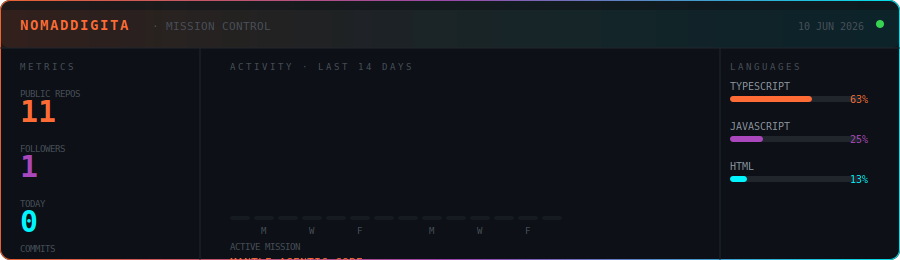
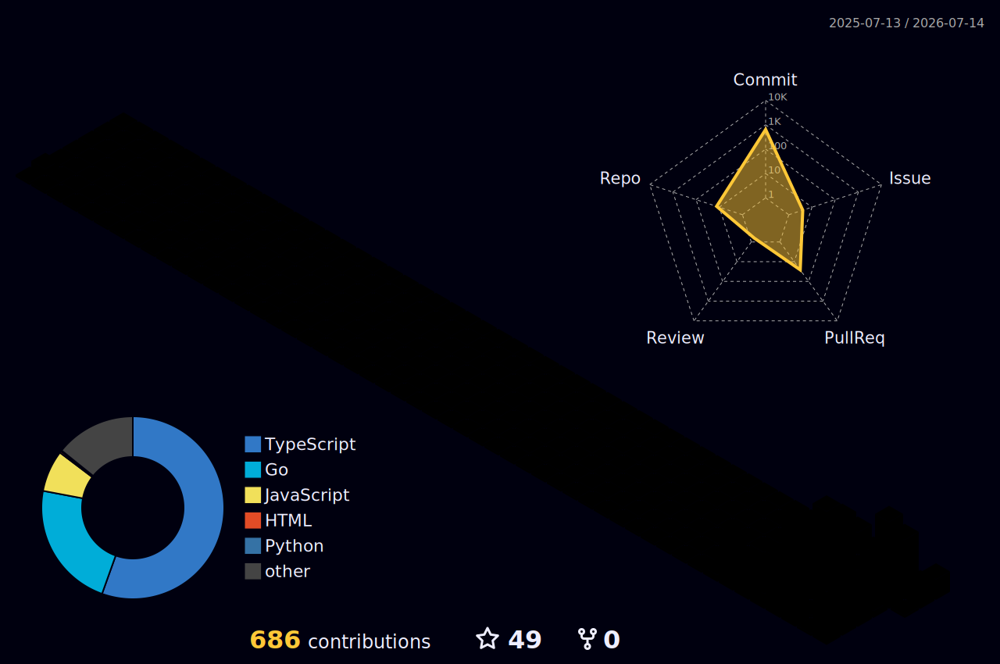
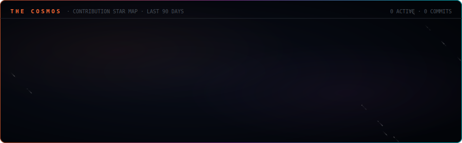
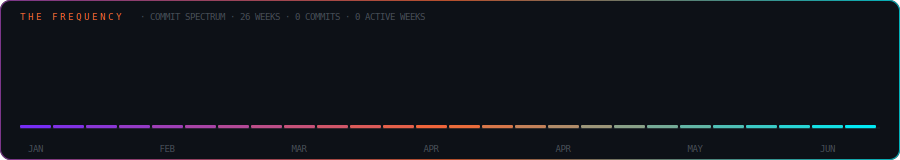

 

  

 

  <em>I build onchain AI agents that act without permission.</em> 
  <em>I craft DeFi interfaces that make complexity invisible.</em> 
  <em>I write smart contracts that execute without borders.</em> 
  <em>I ship because building is the only language I speak.</em>

 

---

## ◈ Mission Control

  

---

## 📡 Live Transmission

<!-- DEVLOG_START -->
> 🤖 **Gemini AI wrote this** · Initializing...

*The Digital Vagabond is booting up the dev log — check back tomorrow.*
<!-- DEVLOG_END -->

---

## ◈ The Codex

<pre align="center">
  ALIAS        →  NomadDigita · Digital Vagabond · he/him
  DISCIPLINE   →  Web3 Engineer · AI Developer · Game Architect
  PHILOSOPHY   →  Onchain first. AI-native always. Ship without permission.
  OBSESSION    →  Autonomous agents that act while the world sleeps.
  TIMEZONE     →  Building at midnight. Shipping at dawn.
</pre>

---

## ◈ Deployed

<table width="100%">
<tr>
<td width="50%" valign="top"> 

**[🤖 mantle-agentic-core](https://github.com/NomadDigita/mantle-agentic-core)**

When AI needed to go fully onchain — agents that execute, monitor, and self-optimize in real-time without human intervention.

 </td>
<td width="50%" valign="top"> 

**[📈 TradeMind-AI](https://github.com/NomadDigita/TradeMind-AI)**

When trading needed intelligence baked in — an AI-native platform that thinks, analyzes, and acts while you sleep.

 </td>
</tr>
<tr>
<td width="50%" valign="top"> 

**[💹 Asiwaju-Trading-Hub](https://github.com/NomadDigita/Asiwaju-Trading-Hub)**

When DeFi complexity needed to disappear — built for traders who move at the speed of the chain.

 </td>
<td width="50%" valign="top"> 

**[🛡️ RugGuard-AI](https://github.com/NomadDigita/RugGuard-AI)**

When DeFi needed a shield — AI-powered rug pull detection before you lose everything.

 </td>
</tr>
<tr>
<td width="50%" valign="top"> 

**[🤖 BuildersBot](https://github.com/NomadDigita/BuildersBot)**

When the Web3 builders community needed automation — handles the noise so humans can build.

 </td>
<td width="50%" valign="top"> 

**[🐾 Furwhisk-telegram-bot](https://github.com/NomadDigita/Furwhisk-telegram-bot)**

Proving that great developer experience starts with the interface people already live inside.

 </td>
</tr>
</table>

---

## ◈ The Manifest

<pre align="center">
  INTERFACES   →  Next.js  ·  React  ·  TypeScript  ·  Tailwind  ·  Framer Motion  ·  Vite
  ONCHAIN      →  Solidity  ·  Wagmi  ·  Viem  ·  Ethers.js  ·  Hardhat  ·  IPFS  ·  Chainlink
  INTELLIGENCE →  Python  ·  Node.js  ·  Go  ·  GraphQL  ·  PostgreSQL  ·  MongoDB  ·  Redis
  SYSTEMS      →  Docker  ·  AWS  ·  Vercel  ·  Nginx  ·  Linux  ·  Git  ·  Bash
  REALITIES    →  Unity  ·  Unreal Engine  ·  Three.js  ·  WebGL  ·  Godot  ·  Blender
</pre>

  

---

## ◈ Signal Strength

  

  
  
  

  

---

## ◈ The Universe

<picture>
  <source media="(prefers-color-scheme: dark)" srcset="profile-3d-contrib/profile-night-rainbow.svg"/>
  <source media="(prefers-color-scheme: light)" srcset="profile-3d-contrib/profile-green-animate.svg"/>
  
</picture>

 

  

 

  

<picture>
  <source media="(prefers-color-scheme: dark)" srcset="https://raw.githubusercontent.com/NomadDigita/NomadDigita/output/github-contribution-grid-snake-dark.svg"/>
  <source media="(prefers-color-scheme: light)" srcset="https://raw.githubusercontent.com/NomadDigita/NomadDigita/output/github-contribution-grid-snake.svg"/>
  
</picture>

---

## 📜 The Chronicles

*An auto-written record of the build — updated every Sunday by Gemini AI.*

<!-- CHRONICLES_START -->
### ◈ Week 23 · 2026 · 8 June 2026

*The vagabond was silent this week.*
<!-- CHRONICLE_ENTRY -->
<!-- CHRONICLES_END -->

---

## 📡 Transmission Frequency

  
  
  

 

  

