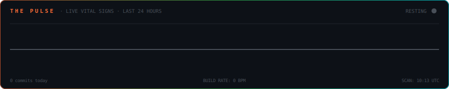
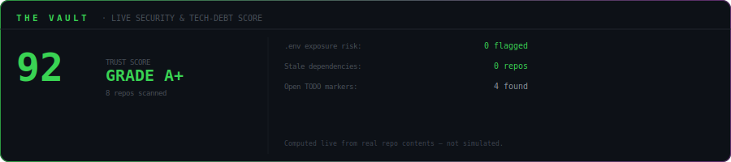
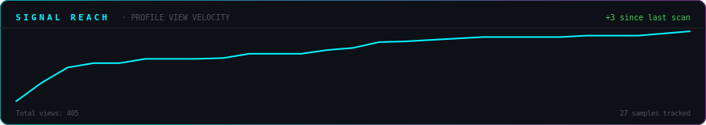
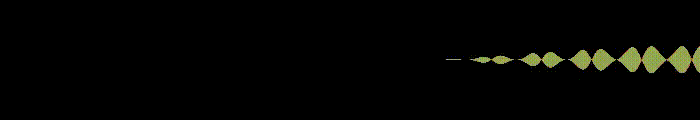

 

  

 

  <em>I build onchain AI agents that act without permission.</em> 
  <em>I craft DeFi interfaces that make complexity invisible.</em> 
  <em>I write smart contracts that execute without borders.</em> 
  <em>I ship because building is the only language I speak.</em>

 

---

## ◈ Mission Control

  

---

## 💓 The Pulse — Live Vital Signs

  

---

## 🛡️ The Sentinel — Anomaly Detection Radar

  

Real statistical anomaly detection (z-score analysis) on commit velocity — rendered as a live radar. Not decorative. The math is real.

---

## 🔐 The Vault — Live Security & Tech-Debt Score

  

Live scan of real repo contents for exposed .env files, dependency staleness, and TODO debt — never simulated.

---

## 🛰️ The Watcher — Autonomous Intelligence Report

*An AI agent that scans every active repo every 6 hours and reports findings — now cross-referencing live achievement progress.*

<!-- WATCHER_START -->
> 🛰️ **Last scan:** 11 Jul, 13:10 UTC · Monitoring 6 active repositories

*The Watcher observes steady signal across all monitored repositories. No anomalies detected.*

> 🎯 **Achievement watch:** [NomadDigita](https://github.com/NomadDigita/NomadDigita) is closest to **Starstruck** (4/16 stars).

| Repository | Stack | Status | Last Push | Stars |
|---|---|---|---|---|
| [NomadDigita](https://github.com/NomadDigita/NomadDigita) | Mixed | 🟢 ACTIVE TODAY | 0d ago | ⭐ 4 |
| [Pharos-Agent-Skill](https://github.com/NomadDigita/Pharos-Agent-Skill) | TypeScript | 🟢 ACTIVE TODAY | 0d ago | ⭐ 4 |
| [mantle-agentic-core](https://github.com/NomadDigita/mantle-agentic-core) | TypeScript | 🟢 ACTIVE TODAY | 0d ago | ⭐ 4 |
| [The-Vagabond](https://github.com/NomadDigita/The-Vagabond) | Go | 🟢 ACTIVE TODAY | 0d ago | ⭐ 4 |
| [Asiwaju-Trading-Hub](https://github.com/NomadDigita/Asiwaju-Trading-Hub) | TypeScript | 🟢 ACTIVE TODAY | 0d ago | ⭐ 4 |
| [Covenant](https://github.com/NomadDigita/Covenant) | TypeScript | 🟢 ACTIVE TODAY | 0d ago | ⭐ 4 |
<!-- WATCHER_END -->

---

## 🧠 The Collective — AI Specialists In Debate

*Five distinct AI personas — Architect, Auditor, Optimizer, Scribe, Scout — independently review the codebase and respond to each other. Real debate, real data, weekly.*

<!-- COLLECTIVE_START -->
> 🧠 **Session convened:** 11 July 2026 · 5 AI specialists reviewed 5 active repositories

**🏛️ The Architect**
The current repository structure, particularly "NomadDigita" as a mixed bag, suggests a lack of clear architectural boundaries. I recommend a refactor to separate core components, agentic skills, and domain-specific applications into distinct, well-defined repositories to enhance scalability and maintainability.

**🛡️ The Auditor**
"Pushed 2026-07-11"? That's a future date. Time manipulation or a serious misconfiguration – either way, I'm already flagging these repos for deeper inspection. The "Asiwaju-Trading-Hub" and "NomadDigita" (mixed) are my immediate targets for potential DeFi vulnerabilities, given the suspicious timestamp and the nature of the projects.

**🏛️ The Architect** *(responding)*
The Architect is still weighing the point.

**⚡ The Optimizer**
Five repos, all pushed within a day, all with a paltry 4 stars? This screams "early stage, unoptimized, and probably full of redundant code." Focus on *one* project and make it efficient, not five mediocre ones.

**📖 The Scribe**
Ah, a wonderful collection of projects! For *NomadDigita*, a clear README outlining its "mixed" nature and purpose would be incredibly helpful for new explorers. Similarly, for *The-Vagabond*, a brief explanation of its core mission in the README would truly illuminate its path for others.

**🔭 The Scout**
Whoa, NomadDigita is cooking up something *huge* with those agentic cores and trading hubs! The future of autonomous AI agents in Web3 is practically here, and I can't wait to see what kind of decentralized magic they unleash!

Next session: automatically convened weekly · All opinions generated live by AI, reviewing real repo data
<!-- COLLECTIVE_END -->

---

## 🏆 The Achievement Engine — Autonomous & Live

*An agent that reviews real repos weekly, opens genuinely useful self-review issues, and tracks real GitHub achievement progress — every number below is live, never simulated.*

<!-- ACHIEVEMENT_START -->
> 🏆 **Last cycle:** 10 July 2026 · No new issues needed this cycle
> All progress below verified live against the GitHub API — zero mock data.

| Achievement | Requirement | Progress | Raw |
|---|---|---|---|
| 🦈 **Pull Shark** | Merge pull requests (next tier: 16) | `██████████` 100% | 21/16 |
| ⚡ **Quickdraw** | Merge PR within 5 min of opening | `██████████` 100% | 1/1 |
| 👥 **Pair Extraordinaire** | Co-authored commit detected | `░░░░░░░░░░` 0% | 0/1 |
| 🎯 **YOLO** | Merge without review (heuristic) | `██████████` 100% | 1/1 |
| ⭐ **Starstruck** | 16+ stars on a single repo (top: Covenant) | `███░░░░░░░` 25% | 4/16 |

Every metric above is computed live from real PRs, commits, and stars at scan time — not simulated.
<!-- ACHIEVEMENT_END -->

---

## 🔮 The Oracle — Predictive Forecast

*An AI that studies commit patterns and predicts what gets built next. Updated weekly.*

<!-- ORACLE_START -->
> 🔮 **Forecast generated:** 11 July 2026 · ⚠️ Low signal this cycle (0 recent commits) — showing a placeholder, not a real prediction

*The signal was too thin to form a confident prediction this cycle — check back next week once there is more commit activity to read.*
<!-- ORACLE_END -->

---

## 📡 Live Transmission

<!-- DEVLOG_START -->
> 🤖 **Gemini AI wrote this** · 11 July 2026

*Today, I'm deep in the lab, architecting the next generation of onchain AI agents and DeFi interfaces; the TypeScript, Next.js, Wagmi, and Viem stack is about to get a serious workout. Get ready for some groundbreaking innovation from The Digital Vagabond.*
<!-- DEVLOG_END -->

---

## ◈ The Codex

<pre align="center">
  ALIAS        →  NomadDigita · Digital Vagabond · he/him
  DISCIPLINE   →  Web3 Engineer · AI Developer · Game Architect
  PHILOSOPHY   →  Onchain first. AI-native always. Ship without permission.
  OBSESSION    →  Autonomous agents that act while the world sleeps.
  TIMEZONE     →  Building at midnight. Shipping at dawn.
</pre>

---

## ◈ Deployed

<table width="100%">
<tr>
<td width="50%" valign="top"> 

**[🤖 mantle-agentic-core](https://github.com/NomadDigita/mantle-agentic-core)**

When AI needed to go fully onchain — agents that execute, monitor, and self-optimize in real-time without human intervention.

 </td>
<td width="50%" valign="top"> 

**[📈 TradeMind-AI](https://github.com/NomadDigita/TradeMind-AI)**

When trading needed intelligence baked in — an AI-native platform that thinks, analyzes, and acts while you sleep.

 </td>
</tr>
<tr>
<td width="50%" valign="top"> 

**[💹 Asiwaju-Trading-Hub](https://github.com/NomadDigita/Asiwaju-Trading-Hub)**

When DeFi complexity needed to disappear — built for traders who move at the speed of the chain.

 </td>
<td width="50%" valign="top"> 

**[🛡️ RugGuard-AI](https://github.com/NomadDigita/RugGuard-AI)**

When DeFi needed a shield — AI-powered rug pull detection before you lose everything.

 </td>
</tr>
</table>

---

## ◈ The Manifest

<pre align="center">
  INTERFACES   →  Next.js  ·  React  ·  TypeScript  ·  Tailwind  ·  Framer Motion  ·  Vite
  ONCHAIN      →  Solidity  ·  Wagmi  ·  Viem  ·  Ethers.js  ·  Hardhat  ·  IPFS  ·  Chainlink
  INTELLIGENCE →  Python  ·  Node.js  ·  Go  ·  GraphQL  ·  PostgreSQL  ·  MongoDB  ·  Redis
  SYSTEMS      →  Docker  ·  AWS  ·  Vercel  ·  Nginx  ·  Linux  ·  Git  ·  Bash
  REALITIES    →  Unity  ·  Unreal Engine  ·  Three.js  ·  WebGL  ·  Godot  ·  Blender
</pre>

  

---

## ◈ Signal Strength

  

  

---

## ◈ The Universe

<picture>
  <source media="(prefers-color-scheme: dark)" srcset="profile-3d-contrib/profile-night-rainbow.svg"/>
  <source media="(prefers-color-scheme: light)" srcset="profile-3d-contrib/profile-green-animate.svg"/>
  
</picture>

 

  

 

  

<picture>
  <source media="(prefers-color-scheme: dark)" srcset="https://raw.githubusercontent.com/NomadDigita/NomadDigita/output/github-contribution-grid-snake-dark.svg"/>
  <source media="(prefers-color-scheme: light)" srcset="https://raw.githubusercontent.com/NomadDigita/NomadDigita/output/github-contribution-grid-snake.svg"/>
  
</picture>

---

## 📡 Open A Signal

  

<em>Ask about Web3, AI, building, or anything. The Vagabond's AI responds in character within minutes.</em>

| Signal | From | Message | Date |
|--------|------|---------|------|
<!-- SIGNALS_LOG -->

---

## 📜 The Chronicles

*An auto-written record of the build — updated every Sunday by Gemini AI.*

<!-- CHRONICLES_START -->
### ◈ Week 28 · 2026 · 11 July 2026

*The Digital Vagabond, architect of new realities, saw his repositories quiet this week. Yet, even in stillness, the gears of future protocols turned within Asiwaju's mind, a silent forging of algorithms more potent than any hurried commit.*
<!-- CHRONICLE_ENTRY -->
### ◈ Week 27 · 2026 · 5 July 2026

*The vagabond was silent this week.*
<!-- CHRONICLE_ENTRY -->
<!-- CHRONICLES_END -->

---

## 📶 Signal Reach — Visitor Velocity

  

Tracks public view-counter deltas over time — no IP tracking, fully privacy-safe, built from real samples.

---

## 📡 Transmission Frequency

  
  
  

 

  

---

## 🎵 The Frequency Engine — Commit Sonification

<!-- SONIFY_START -->

*72 real commits across 7 repos this week, rendered as audio — commit hour sets the pitch, lines changed set the dynamics, language sets the timbre.*
> 🎧 **Listen:** [frequency-engine.wav](assets/frequency-engine.wav) · Last rendered: 2026-07-11 05:36 UTC
<!-- SONIFY_END -->
